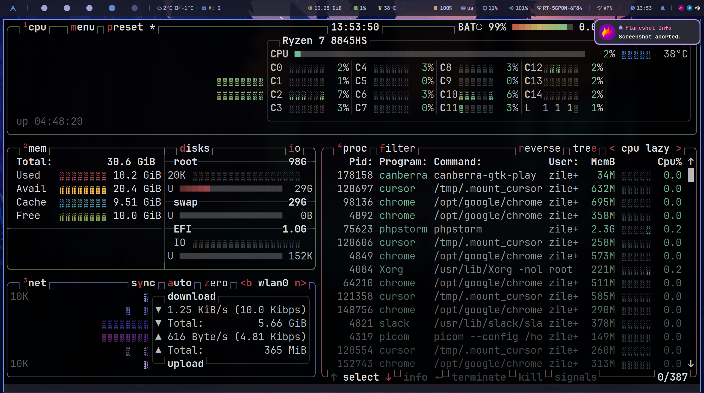

# 🌟 Arch Install Kit
### *Meticulously crafted Arch Linux configuration for developers*

## ✨ Features

- 🎨 **Modern Design** - Hyprland with Catppuccin theme
- ⚡ **High Performance** - Optimized for speed and responsiveness
- 🛠️ **Developer Tools** - Full development environment
- 🔒 **Security Focus** - Enhanced system security
- 🤖 **Automation** - Streamlined installation process

## 🖥️ System Components

| Category | Software |
|----------|----------|
| 🪟 Window Manager | [Hyprland](https://hyprland.org) |
| 📟 Terminal | [Alacritty](https://alacritty.org) |
| 🐚 Shell | [Fish](https://fishshell.com) |
| 📝 Editor | [Vim](https://www.vim.org) |
| 📂 File Manager | [Thunar](https://docs.xfce.org/xfce/thunar/start) / [Ranger](https://github.com/ranger/ranger) |
| 📊 Status Bar | [Waybar](https://github.com/Alexays/Waybar) |
| 🚀 Launcher | [Rofi](https://github.com/davatorium/rofi) |

## 📸 Gallery

🎬 Click to see more screenshots

### 🖥️ Calendar and Calculator View

### 📂 File Explorer

### 💻 CLI File Manager

### 💻 Application Manager

### 📈 Task Manager

### 📈 Several Terminals

## 📚 Documentation

- [🤖 **Automatic Install**](./docs/INSTALL_AUTO.md) - Quick setup guide
- [📝 **Manual Install**](./docs/INSTALL_MANUALLY.md) - Detailed installation steps
- [📦 **Software List**](./docs/ARCH_SOFTWARE.md) - Available packages
- [⚙️ **System Config**](./docs/SYSTEM_SETTINGS.md) - Configuration details
- [🔧 **Shell Scripts**](./docs/SHELL_SCRIPTS.md) - Utility scripts
- [🐟 **Fish Shell**](./docs/FISH_SHELL.md) - Shell configuration

## ⚡ Requirements

- 💿 Arch Linux base system
- 🌐 Active internet connection
- 💻 Basic terminal knowledge

## 🤝 Contributing

1. Fork the repository
2. Create feature branch (`git checkout -b feature/amazing`)
3. Commit changes (`git commit -am 'Add amazing feature'`)
4. Push branch (`git push origin feature/amazing`)
5. Open a Pull Request

## 👤 Author

  <a href="https://career.habr.com/zilero">
    
     
    <b>Artemev Alexandr</b>
  </a>

  
  

## 📄 License

This project is licensed under the MIT License - see the [LICENSE](LICENSE) file for details.