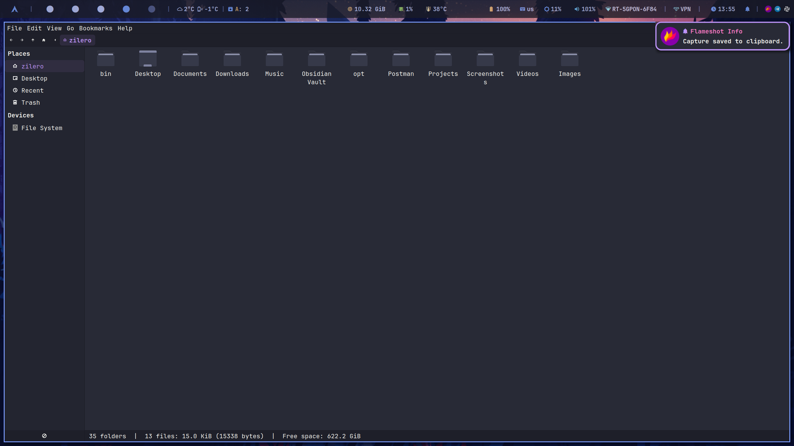
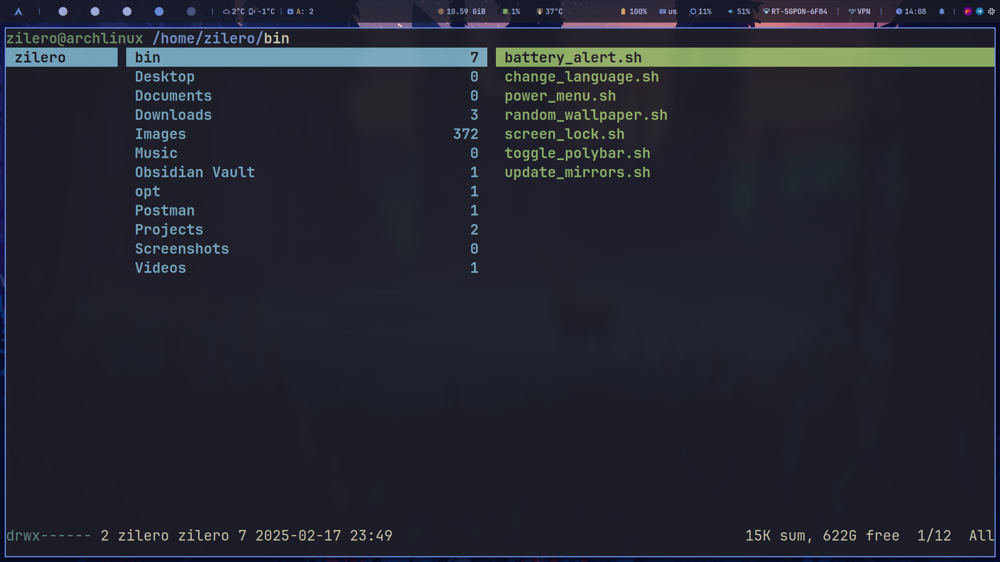
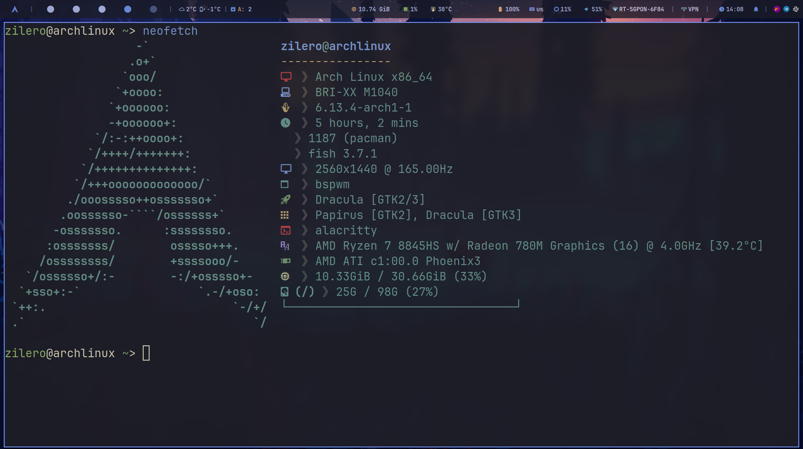
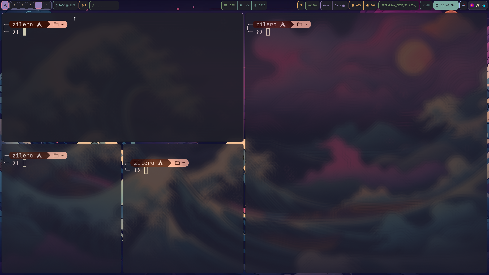

# 🎯 Arch Linux Configuration by Artemev Alexandr

## 🌟 Overview

Welcome to my meticulously crafted Arch Linux configuration! This repository houses my personal setup, designed for maximum productivity and aesthetic appeal.

## 📸 Screenshots

✨ Click to see the magic!

### 🖥️ Calendar and Calculator View

### 📂 File Explorer

### 💻 CLI File Manager

### 💻 Application manager

### 📊 System Information

### 📈 Several Terminals

## 📚 Documentation

### 📖 Installation Guides
- [🤖 Automatic Installation](./docs/INSTALL_AUTO.md)
  > Streamlined installation process with automation scripts

- [📝 Manual Installation](./docs/INSTALL_MANUALLY.md)
  > Detailed step-by-step guide for customized setup

### ⚙️ Configuration
- [📦 Software Collection](./docs/ARCH_SOFTWARE.md)
  > Curated list of essential software and tools

- [🛠️ System Settings](./docs/SYSTEM_SETTINGS.md)
  > Optimized system configurations

- [🔧 Shell Scripts](./docs/SHELL_SCRIPTS.md)
  > Utility scripts for system maintenance

## ✨ Features

- 🎨 Minimal and elegant design
- ⚡ Performance optimizations
- 🔒 Security enhancements
- 🎯 Developer-focused tools
- 🤖 Automation scripts

## 🖥️ System Components
 
| Category | Software |
|----------|----------|
| 🪟 Window Manager | Hyprland |
| 📟 Terminal | Alacritty |
| 🐚 Shell | fish |
| 📝 Editor | Vim / Neovim |
| 📂 File Manager | thunar / ranger |
| 📊 Status Bar | Waybar |
| 🔔 Notifications | swaync |
| 🚀 Launcher | Rofi |
| 🎨 Display Manager | SDDM |
| 🎮 Boot Splash | Plymouth |

## ⚡ Requirements

- 💿 Arch Linux base system
- 🌐 Active internet connection
- 💻 Basic terminal knowledge

## 🤝 Contributing

We'd love for you to contribute to `arch-install-kit`! Whether it's reporting bugs, suggesting features, or submitting pull requests, your help is always appreciated.

### How to contribute:

1. Fork the repository.
2. Create a new branch (`git checkout -b feature/your-feature`).
3. Make your changes.
4. Commit your changes (`git commit -am 'Add new feature'`).
5. Push to the branch (`git push origin feature/your-feature`).
6. Open a pull request.

## 📜 Code of Conduct

Please follow our [Code of Conduct](CODE_OF_CONDUCT.md) when participating in this project to ensure a welcoming and productive atmosphere.

## 🔒 Security Policy

Security is our priority. If you encounter any issues, please read our full [Security Policy](SECURITY.md) to report vulnerabilities safely and responsibly.

## 👥 Team

These folks keep the project moving and are resources for help.

<table>
  <tbody>
    <tr>
      <td align="center" valign="top" width="11%">
        <a href="https://career.habr.com/zilero">
          
           
          Artemev A. A.
        </a>
      </td>
    </tr>
  </tbody>
</table>

## 📄 License

License `arch-install-kit` is licensed under the [MIT License](LICENSE).